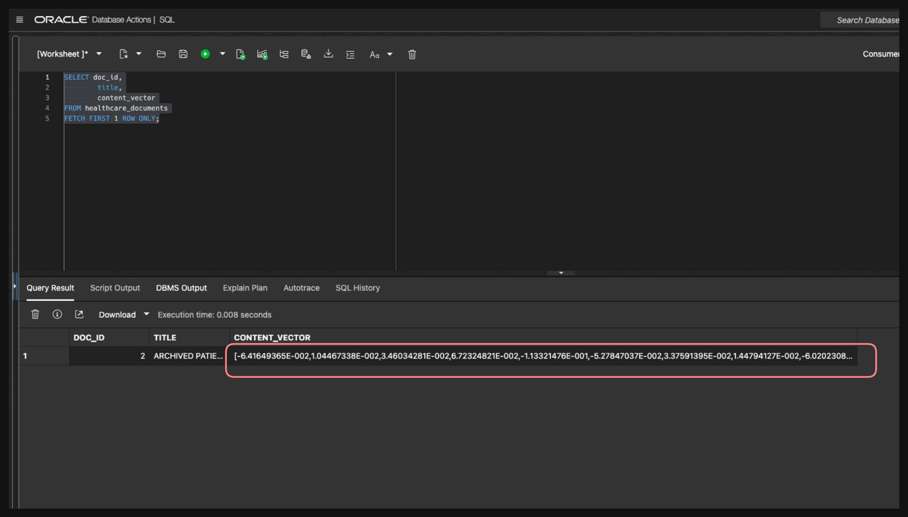
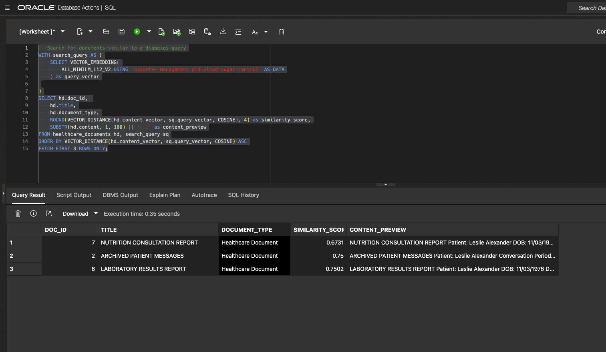
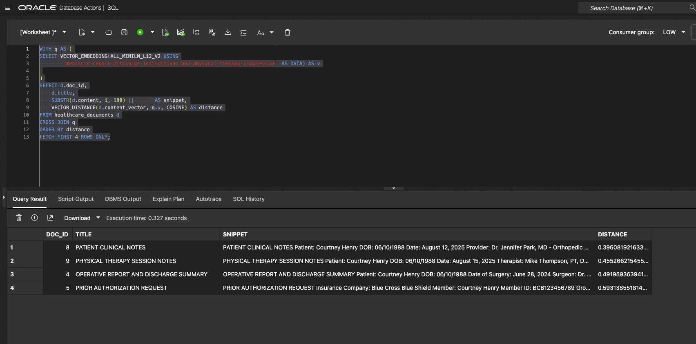
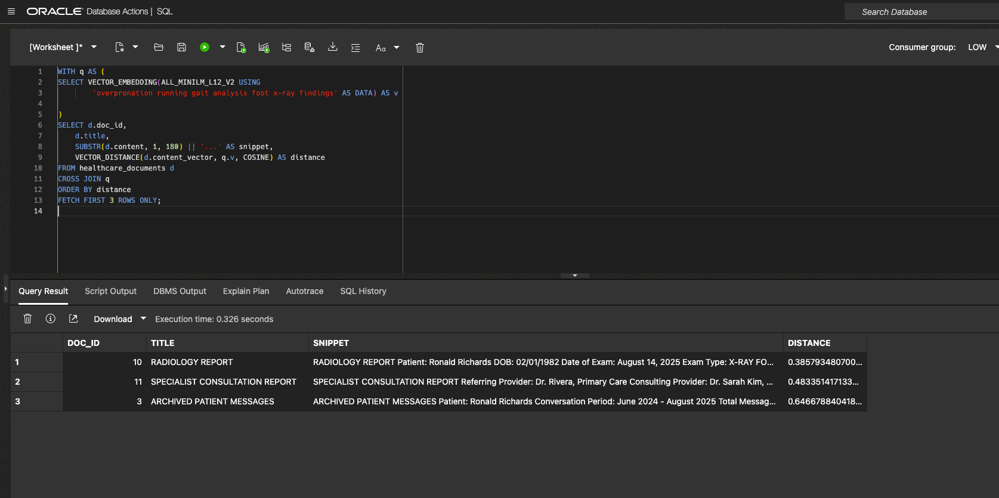

# Lab: Oracle AI Vector Search for Healthcare Documents

## Introduction

Welcome to the **Oracle AI Vector Search** lab! In this hands-on session, you'll learn how to search documents by **meaning** rather than just matching exact words.

Traditional database searches look for exact text matches. But what if you want to find documents about "knee pain" and also discover records mentioning "joint discomfort" or "patella issues"? Vector search solves this by understanding that these terms have similar meanings.

Building on the patient data from our previous labs, you'll learn how to set up vector search to find relevant medical information across healthcare documents, even when they use different terminology.

Estimated Lab Time: 25 minutes

### What You'll Learn

- How vector search finds documents by meaning, not just keywords
- Setting up the AI model that powers semantic search
- Loading healthcare documents into searchable format
- Performing "find similar documents" searches
- Connecting search results to existing patient data

### Prerequisites

- Access to Oracle Database  23ai
- Completion of previous LumenCare labs
- Basic SQL knowledge


## Task 1: Load the AI Model for Vector Search

1. **How vector search works:** To find documents by meaning, Oracle needs to convert text into numbers called "vectors." Think of vectors as coordinates that represent the meaning of text. Documents with similar meanings get similar vectors, making them easy to find.

    For example:
    - "knee surgery recovery" might become vectors like [0.2, 0.8, 0.1, ...]
    - "joint operation healing" would get very similar vectors
    - "diabetes management" would get completely different vectors

2. **Why we need a model:** To convert text to these meaningful vectors, we need an AI model. Oracle lets you load these models directly into the database for secure, fast processing.

    In this task, we'll load a pre-trained model called **ALL\_MiniLM\_L12\_v2** that's optimized for understanding general text.

3. **Load the model into your database:** The code below downloads the AI model and installs it in your database. This is a one-time setup that lets Oracle convert text to vectors without needing external services.

    ```sql
    <copy>
    DECLARE 
        ONNX_MOD_FILE VARCHAR2(100) := 'all_MiniLM_L12_v2.onnx';
        MODNAME VARCHAR2(500);
        LOCATION_URI VARCHAR2(200) := 'https://adwc4pm.objectstorage.us-ashburn-1.oci.customer-oci.com/p/eLddQappgBJ7jNi6Guz9m9LOtYe2u8LWY19GfgU8flFK4N9YgP4kTlrE9Px3pE12/n/adwc4pm/b/OML-Resources/o/';

    BEGIN
        DBMS_OUTPUT.PUT_LINE('ONNX model file name in Object Storage is: '||ONNX_MOD_FILE); 

        SELECT UPPER(REGEXP_SUBSTR(ONNX_MOD_FILE, '[^.]+')) INTO MODNAME  ;
        DBMS_OUTPUT.PUT_LINE('Model will be loaded and saved with name: '||MODNAME);

        BEGIN DBMS_DATA_MINING.DROP_MODEL(model_name => MODNAME); EXCEPTION WHEN OTHERS THEN NULL; END;

        DBMS_CLOUD.GET_OBJECT(                            
            credential_name => NULL,
            directory_name => 'DATA_PUMP_DIR',
            object_uri => LOCATION_URI || ONNX_MOD_FILE);

        DBMS_VECTOR.LOAD_ONNX_MODEL(
            directory => 'DATA_PUMP_DIR',
            file_name => ONNX_MOD_FILE,
            model_name => MODNAME);

        DBMS_OUTPUT.PUT_LINE('New model successfully loaded with name: '||MODNAME);
    END;
    </copy>
    ```

2. Now Check ONNX Runtime availability
    ```sql
    <copy>
    SELECT model_name, mining_function
    FROM user_mining_models
    WHERE model_name = 'ALL_MINILM_L12_V2';
    </copy>
    ```

## Task 2: Create a Table to Store Documents and Their Vectors

1. Now we need a place to store both the original healthcare documents and their vectors.

2. Let's create our storage table:

    ```sql
    <copy>
        -- Create table to store healthcare documents
        CREATE TABLE IF NOT EXISTS healthcare_documents (
            doc_id NUMBER GENERATED BY DEFAULT AS IDENTITY,
            title VARCHAR2(200),
            content CLOB,
            document_type VARCHAR2(50),
            created_date DATE DEFAULT SYSDATE,
            CONSTRAINT pk_healthcare_docs PRIMARY KEY (doc_id)
        );

        -- Add the new vector column to store vectors
        ALTER TABLE healthcare_documents ADD (
            content_vector VECTOR(384, FLOAT32)
        );
    </copy>
    ```

    **What this creates:**
    - **Regular columns**: `title`, `content`, `document_type` store the readable text
    - **Vector column**: `content_vector` stores 384 dimension vectors for each document
    - **VECTOR(384, FLOAT32)**: This special data type tells Oracle we're storing 384 decimal numbers that represent document meaning


## Task 3: Load Sample Healthcare Documents

1. Now we need some healthcare documents to search through. We've prepared realistic sample documents that represent different types of medical records you might find in a healthcare system:

    - Patient messages and communications
    - Discharge summaries and clinical notes  
    - Lab results and radiology reports
    - Insurance authorizations and referrals

    These documents are stored in Oracle Cloud storage, and we'll download them directly into our database table.

2. **Load the documents:** The code below downloads 11 sample healthcare documents and stores them in our table. Don't worry about understanding all the technical details - the important part is that it's loading realistic medical documents for us to search.

    ```sql
    <copy>
        DECLARE
            l_blob       BLOB;
            l_content    CLOB;
            l_title      VARCHAR2(500);
            l_first_line VARCHAR2(1000);
            l_doc_count  PLS_INTEGER := 0;

            TYPE url_array IS VARRAY(100) OF VARCHAR2(2000);
            l_file_urls url_array := url_array(
                    'https://objectstorage.us-ashburn-1.oraclecloud.com/p/VmOEXelaGdlmUe8hv6fsgEBKrWKx7nFoDSsVB71BdLoU_DfrLc6skHreAXet1ce4/n/oradbclouducm/b/aiworld-demo/o/archived_messages_courtney.txt',
                    'https://objectstorage.us-ashburn-1.oraclecloud.com/p/8hQojUmNUeg18p_JqyBQ1O7s-X7kqdO4aOpzfvAdjZdTtBoH5_CwsGaCVF7KiOXe/n/oradbclouducm/b/aiworld-demo/o/archived_messages_leslie.txt',
                    'https://objectstorage.us-ashburn-1.oraclecloud.com/p/Ir9SipDVumKh2caDBHgNM9DFDuGvw5jtbP77HvlfGp4eVNC25PsLsCyPYWTvGLTO/n/oradbclouducm/b/aiworld-demo/o/archived_messages_ronald.txt',
                    'https://objectstorage.us-ashburn-1.oraclecloud.com/p/2VMjjOiG2lMOJ0SEYh-PuFrQ2J1JsrR1quPwbqIQzAN6SDAfIDb3wcPmC3_iyvrt/n/oradbclouducm/b/aiworld-demo/o/discharge_summary_courtney.txt',
                    'https://objectstorage.us-ashburn-1.oraclecloud.com/p/hibOcvyK0X5b8LNjbnGG4r_1SMtLDchL2FFJvM1tJ5B4RwBva4gnWcFc1jB777Sf/n/oradbclouducm/b/aiworld-demo/o/insurance_authorization.txt',
                    'https://objectstorage.us-ashburn-1.oraclecloud.com/p/Td5lyfX4_fB2TMQdCyza6jd-UWqPmmiSWKTuKnCS6__FtjuflY3eQkCFlKP7enqd/n/oradbclouducm/b/aiworld-demo/o/lab_results_leslie.txt',
                    'https://objectstorage.us-ashburn-1.oraclecloud.com/p/TTxSm_dz3jrrleTW0Ip5yhOaJ27zCO8Mf1Jt2B8Gs4jvbx2YHm5XiTcE2cMExgC0/n/oradbclouducm/b/aiworld-demo/o/nutrition_consultation_leslie.txt',
                    'https://objectstorage.us-ashburn-1.oraclecloud.com/p/FSgzEsNudwY5RiaYf-DB-hJTFTCMsmtUeV3xLFxSkajcOim2umCHXVoOwor4dQRA/n/oradbclouducm/b/aiworld-demo/o/patient_notes_courtney.txt',
                    'https://objectstorage.us-ashburn-1.oraclecloud.com/p/a5Hk74yKQTCxgcJrycf_OO2LN0HYdkBhtlLT5O4ojIE55f1J8l-ZWWhuXCCLlDOL/n/oradbclouducm/b/aiworld-demo/o/physical_therapy_notes.txt',
                    'https://objectstorage.us-ashburn-1.oraclecloud.com/p/zWoDl9Z1c7ZDgeXQ9629e5nIVOJKYZpgs_it-GiC9WjkEGcHbWB5Au-ft4iRb_cG/n/oradbclouducm/b/aiworld-demo/o/radiology_report_ronald.txt',
                    'https://objectstorage.us-ashburn-1.oraclecloud.com/p/Sm7U-Bl04IxZxL99TamivaWmm9ZEOWxxKypNDDc2DJOEptyZJqrZvlh4VRmPkHn5/n/oradbclouducm/b/aiworld-demo/o/specialist_referral_ronald.txt'
                );
                -- add more URLs here
            BEGIN
            DBMS_OUTPUT.PUT_LINE('Loading healthcare documents from Object Storage...');

            FOR i IN 1 .. l_file_urls.COUNT LOOP
                -- 1) fetch bytes into memory (function form)
                l_blob := DBMS_CLOUD.GET_OBJECT(
                        credential_name => NULL,          -- ok for a pre-authenticated URL
                        object_uri      => l_file_urls(i)
                        );

                -- 2) convert to text (explicit UTF-8 decode; safer than CAST_TO_VARCHAR2)
                l_content := UTL_I18N.RAW_TO_CHAR(l_blob, 'AL32UTF8');

                -- 3) derive a title from the first line
                l_first_line := REGEXP_SUBSTR(l_content, '^[^' || CHR(10) || CHR(13) || ']*');
                l_title := TRIM(l_first_line);

                -- 4) insert WITHOUT embedding for now
                INSERT INTO healthcare_documents (title, content, document_type, content_vector)
                VALUES (l_title, l_content, 'Healthcare Document', NULL);

                l_doc_count := l_doc_count + 1;
                DBMS_OUTPUT.PUT_LINE('✓ Loaded: ' || l_title);
            END LOOP;

            COMMIT;
            DBMS_OUTPUT.PUT_LINE('Successfully loaded ' || l_doc_count || ' documents.');
            END;
            /
    </copy>
    ```
3. **Check what documents were loaded:** Let's see what healthcare documents are now in our table:

    ```sql
    <copy>
        SELECT doc_id,
                title,
                document_type,
                LENGTH(content) as content_length,
                SUBSTR(content, 1, 150) || '...' as content_preview
        FROM healthcare_documents
        ORDER BY doc_id;
    </copy>
    ```

    You should see 11 documents with titles like:
    - "Patient Portal Message: Courtney Henry - Knee Recovery Update"
    - "DISCHARGE SUMMARY - Arthroscopic Meniscus Repair"
    - "LAB RESULTS - Comprehensive Metabolic Panel"
    
    Notice that `content_vector` is NULL for now - we'll create the vector in the next task.


## Task 4: Convert Documents to Vectors

1. **Why we need to convert text to numbers:** To search by meaning, Oracle needs to convert text into numbers called vectors. The AI model reads each document and creates a unique set of vectors that represents what the document is about.

    Documents about similar topics get similar vectors, making them easy to find when we search.

2. **Convert all documents to vectors:** This simple command tells Oracle to read each document and create the vectors:

    ```sql
    <copy>
        UPDATE healthcare_documents
        SET content_vector = VECTOR_EMBEDDING(ALL_MINILM_L12_V2 USING content AS DATA)
        WHERE content IS NOT NULL;
        COMMIT;
    </copy>
    ```

    **What this does:**
    - Takes each document's text content
    - Uses our AI model to convert it to vectors 
    - Stores those vectors in the `content_vector` column
    - Now Oracle can measure how "close" documents are by comparing their vectors

3. **See what the vectors look like:** Let's look at one document's vectors :

    ```sql
    <copy>
        SELECT doc_id,
            title,
            content_vector
        FROM healthcare_documents
        FETCH FIRST 1 ROW ONLY;
    </copy>
    ```

    You'll see 384 decimal numbers like [0.1234, -0.5678, 0.9012, ...]. These numbers are the vectors that represent the document's meaning.

    

## Task 5: Search Documents by Meaning

1. **How vector search works:** Now that our documents are represented as vectors, we can search by meaning instead of exact words. Here's how:
    
    - Type what you're looking for (like "diabetes management")
    - Oracle converts your search phrase to vectors too
    - Oracle finds documents with the most similar vectors
    - Documents with closer vectors = more similar meaning

2. **Try your first semantic search:** Let's search for documents about diabetes management. Notice how this will find relevant documents even if they don't contain the exact words "diabetes management":
    ```
    <copy>
    -- Search for documents similar to a diabetes query
    WITH search_query AS (
        SELECT VECTOR_EMBEDDING(
            ALL_MINILM_L12_V2 USING 'diabetes management and blood sugar control' AS DATA
        ) as query_vector
         
    )
    SELECT hd.doc_id, 
        hd.title,
        hd.document_type,
        ROUND(VECTOR_DISTANCE(hd.content_vector, sq.query_vector, COSINE), 4) as similarity_score,
        SUBSTR(hd.content, 1, 100) || '...' as content_preview
    FROM healthcare_documents hd, search_query sq
    ORDER BY VECTOR_DISTANCE(hd.content_vector, sq.query_vector, COSINE) ASC
    FETCH FIRST 3 ROWS ONLY;
    </copy>
    ```
3. **What you'll see in the results:**
    - Leslie's messages about blood pressure medication (Lisinopril)
    - Nutrition consultation notes about DASH diet
    - Lab results showing cholesterol levels
   
   Notice how vector search found these related documents even though they don't mention "diabetes" explicitly! It understands that blood pressure, diet, and cholesterol are all related to diabetes management.

    

4. Now let's look for Courtney's recovery notes.
    ```
    <copy>
    WITH q AS (
    SELECT VECTOR_EMBEDDING(ALL_MINILM_L12_V2 USING
            'meniscus repair discharge instructions and physical therapy progression' AS DATA) AS v
     
    )
    SELECT d.doc_id,
        d.title,
        SUBSTR(d.content, 1, 180) || '...' AS snippet,
        VECTOR_DISTANCE(d.content_vector, q.v, COSINE) AS distance
    FROM healthcare_documents d
    CROSS JOIN q
    ORDER BY distance
    FETCH FIRST 4 ROWS ONLY;
    </copy>
    ```
    **Expected results:**
    * Courtney's clinical notes 
    * Physical therapy session notes showing progress
    * Operative report and discharge summary after arthroscopic repair
    * Even the MRI authorization request appears, because it's part of the same clinical episode

    Again, vector search connected related documents across different document types - all about the same patient's knee recovery journey.

    

5. Let's try one more. 

    ```
    <copy>
    WITH q AS (
    SELECT VECTOR_EMBEDDING(ALL_MINILM_L12_V2 USING
            'overpronation running gait analysis foot x-ray findings' AS DATA) AS v
     
    )
    SELECT d.doc_id,
        d.title,
        SUBSTR(d.content, 1, 180) || '...' AS snippet,
        VECTOR_DISTANCE(d.content_vector, q.v, COSINE) AS distance
    FROM healthcare_documents d
    CROSS JOIN q
    ORDER BY distance
    FETCH FIRST 3 ROWS ONLY;
    </copy>
    ```

    **What vector search finds:**
    * Radiology foot X-ray showing flatfoot/overpronation
    * Sports medicine consult with cadence and form recommendations
    * Patient messages about training goals and soreness

    This demonstrates how vector search can pull together a complete clinical picture from multiple sources - imaging, specialist reports, and patient communications - all related to foot biomechanics.

    


## Task 6: Speed Up Vector Search with Indexes

1. **Why indexes matter:** With 11 documents, searches are instant. But with thousands or millions of documents, Oracle would have to compare your search against every single document. Vector indexes solve this problem.

2. **Oracle's two vector index types:**
    - **In-Memory Neighbor Graph Index** - Uses HNSW (Hierarchical Navigable Small World) algorithm to create a network of connections between similar documents
    - **Neighbor Partition Index** - Uses IVF (Inverted File indexing) to divide documents into clusters and search only relevant clusters

3. **Create an In-Memory Neighbor Graph Index:** This type is optimized for speed and accuracy:

    ```sql
    <copy>
    -- Create In-Memory Neighbor Graph Vector Index
    -- This type is optimized for fast, accurate searches
    CREATE VECTOR INDEX idx_healthcare_content_inmemory
    ON healthcare_documents(content_vector)
    ORGANIZATION INMEMORY NEIGHBOR GRAPH
    DISTANCE COSINE
    WITH TARGET ACCURACY 95;
    </copy>
    ```

    **What this creates:**
    - `INMEMORY NEIGHBOR GRAPH`: Builds the HNSW network in memory for fastest searches
    - `DISTANCE COSINE`: Uses the same distance measurement as our search queries
    - `TARGET ACCURACY 95`: Finds 95% of the same results as checking every document, but much faster

4. **Verify the index was created:**
    ```sql
    <copy>
    -- Check index status
    SELECT index_name, index_type, status, 
           ityp_owner, ityp_name
    FROM user_indexes 
    WHERE index_name = 'IDX_HEALTHCARE_CONTENT_INMEMORY';
    </copy>
    ```

5. **Alternative: Create a Neighbor Partition Index** (try this option instead):

    ```sql
    <copy>
    -- First drop the previous index
    DROP INDEX idx_healthcare_content_inmemory;

    -- Create Neighbor Partition Vector Index
    -- This type balances speed with memory usage
    CREATE VECTOR INDEX idx_healthcare_content_partition  
    ON healthcare_documents(content_vector)
    ORGANIZATION NEIGHBOR PARTITIONS
    DISTANCE COSINE
    WITH TARGET ACCURACY 95;
    </copy>
    ```

    **When to use each index type:**
    - **INMEMORY NEIGHBOR GRAPH**: Best for fastest searches with smaller datasets
    - **NEIGHBOR PARTITIONS**: Better for very large datasets or when memory is limited
    - Both use `TARGET ACCURACY 95` to balance speed vs precision

6. **Index best practices:**
    - Always use the same distance metric (COSINE) in both index creation and search queries
    - Higher TARGET_ACCURACY values give better results but use more resources
    - In Autonomous Database, vector memory is automatically managed for you


## Conclusion

Congratulations! You've successfully implemented Oracle AI Vector Search for healthcare documents using Oracle Database  23ai. 


## Learn More

* [Oracle Database  23ai AI Vector Search Documentation](https://docs.oracle.com/en/database/oracle/oracle-database/23/vecse/index.html)
* [Vector Data Type Guide](https://docs.oracle.com/en/database/oracle/oracle-database/23/sqlrf/vector.html)
* [AI Vector Search Functions](https://docs.oracle.com/en/database/oracle/oracle-database/23/sqlrf/vector-functions.html)

## Acknowledgements
* **Author** - Killian Lynch, Database Product Management
* **Last Updated By/Date** - Killian Lynch, August 2025